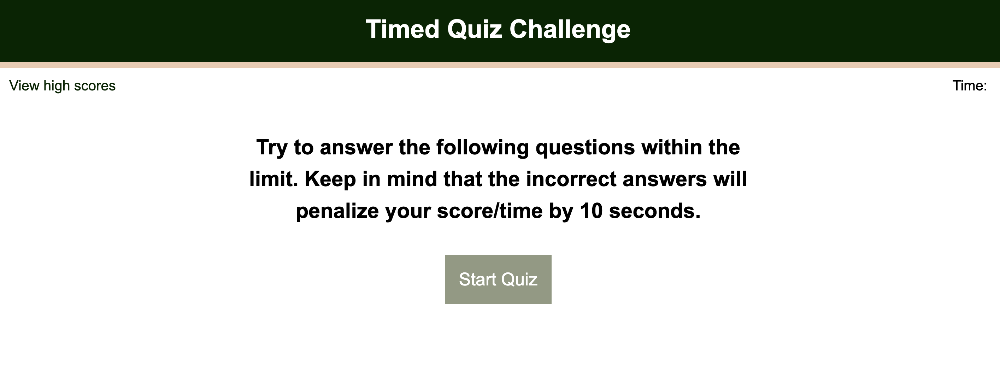
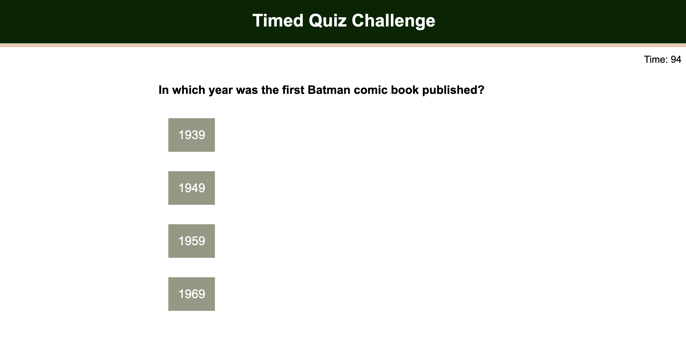
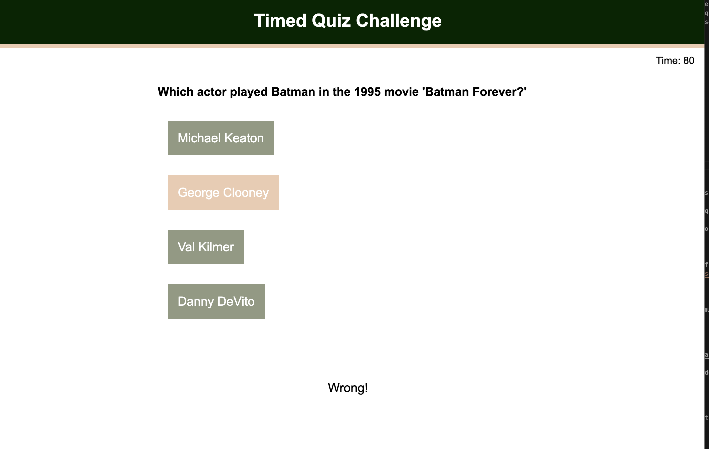
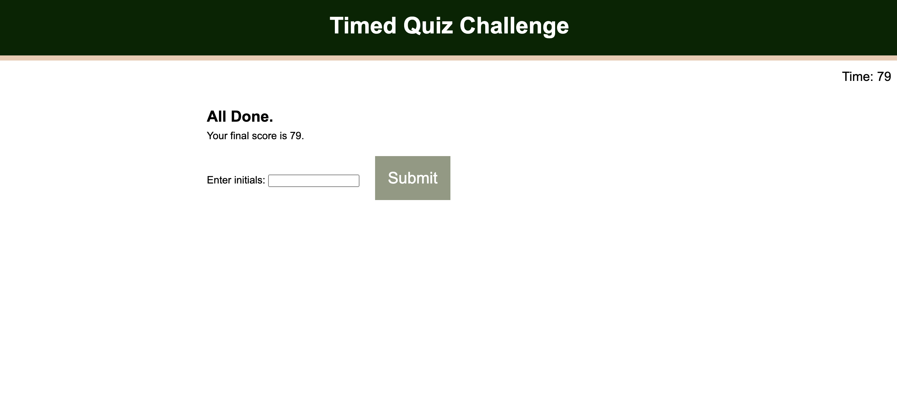
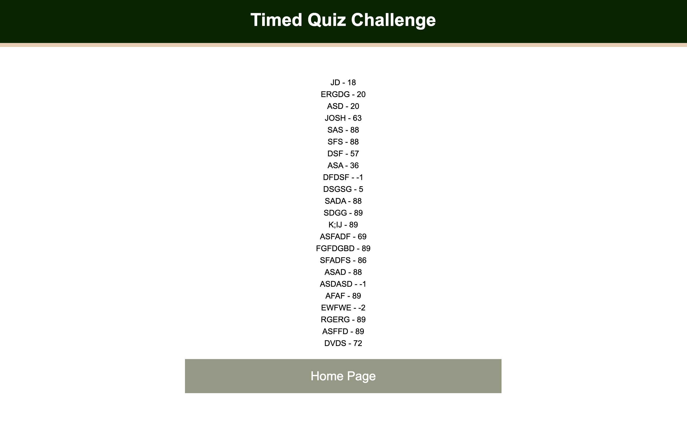
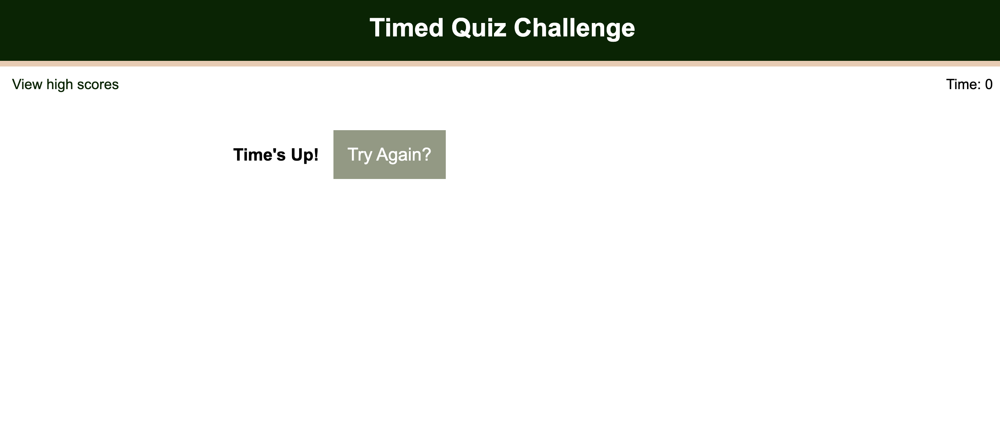

# Time quiz on popular comic book characters and movies

## Description

This website was built in order to showcase the skills of professional coder Joshua Dadbin. This beautiful app is full of javascript functions and event listeners. The user is able to play a fun fact based quiz game with multiple choice answers, all while under a time crunch! The app is fully automated and even docs points for wrong answers. The time left is then the users score, and is saved to be compared to peers.

## Table of Contents 

- [Installation](#installation)
- [Usage](#usage)
- [Credits](#credits)
- [License](#license)

## Installation

N/A

## Usage

The website addres iss (https://autohome.github.io/TimedQuiz/)

The start page has option to view high scores or start the quiz with instruction. 

Once the game has started, a timer starts and the first question appears with 4 answer buttons. Choose wisely.

Once the question is answered, the next question/answer set will appear. Result of previous choice will appear below it. If answered incorrectly, 10 seconds will be taken off the timer.

Upon completion of all questions, users score is shown as well as a form to enter said score in the high scores list. Once submitted, user score and initials get stored in local storage.

Once initials are submitted, user is automatically routed to the high scores page where a link to the home page to play again is.

If timer runs out during game, the time's up page appears where the user can try again.

Currently the site has 10 questions and starts at 100 seconds, however, it has been created to have an unlimited amount of questions. It will also add 10 seconds for each question added.

## Credits

Help from UCLA coding bootcamp staff and students

Reset CSS from [meyerweb.com](https://meyerweb.com/eric/tools/css/reset/)
Inspiration behind question/answer container from [Sitepoint](https://www.sitepoint.com/simple-javascript-quiz/)
Score form listener from [freecodecamp](https://www.freecodecamp.org/news/how-to-submit-a-form-with-javascript/#:~:text=To%20submit%20a%20form%20using,if%20any%20data%20is%20submitted)

## License

MIT License